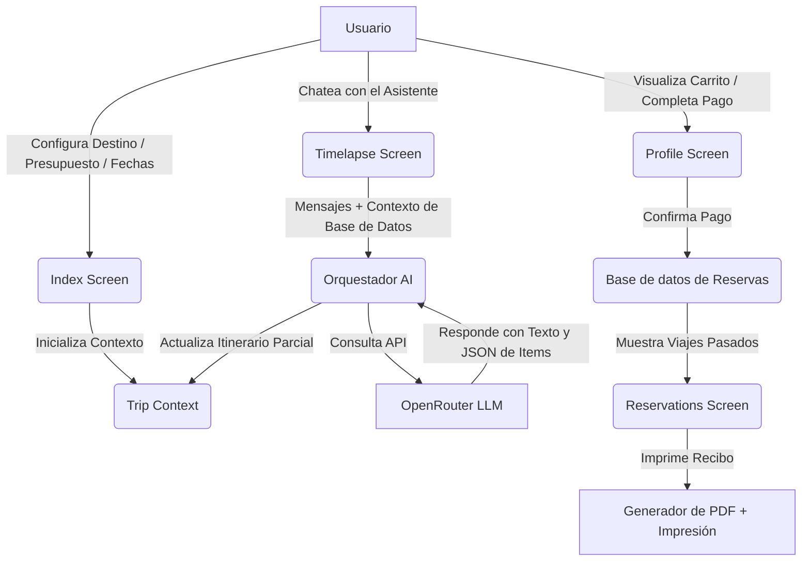
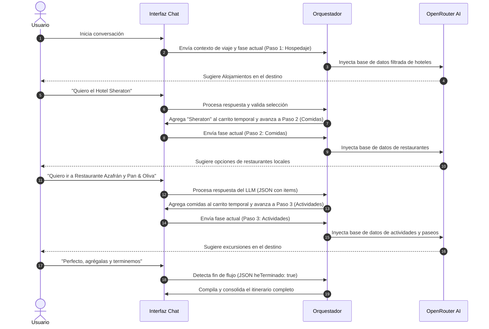

# PlanTrip ✈️

PlanTrip es un planificador de viajes asistido por Inteligencia Artificial estructurado sobre **React Native y Expo**. Permite a los usuarios diseñar itinerarios de viajes a medida, elegir destinos populares de Argentina, gestionar reservas locales y simular pagos con múltiples monedas.

El repositorio cuenta con dos módulos basados en Expo:
1. **PlanTrip Mobile App (`App-Movile/app-PlanTrip`)**: La aplicación completa con gestión de perfiles, calendario, carrito de compras, pasarela de pago, historial de reservas e itinerario interactivo.
2. **Chatbot Standalone (`App-Movile/chat bot`)**: Un prototipo de chat conversacional independiente para interactuar directamente con la IA de viajes.

---

## 🛠️ Tecnologías Utilizadas

Las aplicaciones se construyen usando las siguientes herramientas y librerías modernas de desarrollo móvil:

*   **Framework principal:** [Expo SDK 54](https://expo.dev/) (React Native 0.81.5)
*   **Lenguaje:** [TypeScript](https://www.typescriptlang.org/) (en PlanTrip App) y JavaScript ES6 (en Chatbot)
*   **Ruteo y Navegación:** [Expo Router v6](https://docs.expo.dev/router/introduction/) (Navegación basada en archivos y pestañas)
*   **Estilos y Temas:** HSL custom tokens con soporte para Blur (`expo-blur`) y gradientes dinámicos (`expo-linear-gradient`).
*   **Asistente Inteligente:** Integración directa con [OpenRouter API](https://openrouter.ai/) utilizando modelos como **Meta Llama 3** u otros proveedores mediante Axios.
*   **Almacenamiento Local:** Caché local de sesiones y reservas utilizando LocalStorage persistente.
*   **Visualización / Impresión:** Sistema de conversión a PDF nativo del navegador e interfaz de impresión optimizada.

---

## 🏗️ Arquitectura y Flujos del Sistema

### 1. Arquitectura General
El sistema se compone de componentes interactivos y un orquestador que consume los datos locales predefinidos para inyectarlos como contexto dinámico a la IA de OpenRouter:



### 2. Flujo Conversacional y Planificación por Pasos
La IA guía al usuario de manera secuencial a través de 3 fases de planificación para garantizar una experiencia estructurada y evitar la sobrecarga de información:



---

## 🌟 Funcionalidades Clave

### 📆 Rango de Fechas e Inconsistencias de Calendario
El `CalendarPicker` calcula automáticamente la duración del viaje al seleccionar las fechas de inicio y fin, evitando solapamientos inconsistentes (por ejemplo, seleccionar una fecha de regreso anterior a la de partida reajustará automáticamente el rango). Muestra la duración calculada en tiempo real.

### 🍽️ Distribución Equitativa del Itinerario
Para evitar acumular todas las actividades y comidas en un único día, el backend del orquestador asigna de manera equitativa los items recomendados entre el rango de días del viaje:
*   El hotel seleccionado se extiende automáticamente durante todas las noches.
*   Las comidas se dispersan de manera aleatoria y balanceada entre el día 1 y el último día.
*   Las actividades se programan de manera alternada para optimizar los tiempos de ocio del turista.

### 💳 Gestión del Carrito y Métodos de Pago
En la sección de perfil, el usuario puede revisar todos los ítems agregados por el chatbot conversacional:
*   **Descuentos Bancarios:** Selección de banco o método de pago (Visa, Mastercard, Banco Galicia, etc.) aplicando descuentos del 5% al 20% sobre el total.
*   **Conversión de Moneda:** Conversión en tiempo real de pesos argentinos (ARS) a dólares estadounidenses (USD) o euros (EUR) usando cotizaciones simuladas de mercado.
*   **Confirmación de Pago:** Ventana interactiva de felicitaciones con confeti y emisión de identificador de reserva único.

### 📄 Impresión de Comprobantes PDF
Generación dinámica de comprobantes de reserva con diseño minimalista para su impresión física o exportación a PDF, que incluye:
*   Identificador único de reserva y fecha de compra.
*   Una **Postal digital** representativa del destino elegido (esquina superior derecha).
*   Detalle desglosado día por día de hospedajes, comidas y excursiones.
*   Desglose financiero con descuentos aplicados y total convertido en la divisa seleccionada.

---

## 🚀 Instalación y Lanzamiento

### Prerrequisitos
Asegúrate de contar con [Node.js](https://nodejs.org/) instalado en tu sistema.

### 1. Configuración de Variables de Entorno
Crea un archivo `.env` en los directorios correspondientes para configurar las credenciales de la API de OpenRouter:

*   En `App-Movile/app-PlanTrip/.env`:
    ```env
    EXPO_PUBLIC_OPENROUTER_API_KEY=tu_api_key_aqui
    ```
*   En `App-Movile/chat bot/.env`:
    ```env
    OPENROUTER_API_KEY=tu_api_key_aqui
    ```

### 2. Ejecutar la Aplicación Móvil Principal (`app-PlanTrip`)

Instala las dependencias y lanza el servidor de desarrollo de Expo:

```bash
# Navegar al directorio de la app principal
cd App-Movile/app-PlanTrip

# Instalar dependencias
npm install

# Lanzar la aplicación
npm run web     # Para ejecutar directamente en el navegador (Recomendado para testing rápido de PDF)
# O bien:
npm run android # Para lanzar en Emulador Android / Dispositivo físico con Expo Go
npm run ios     # Para lanzar en Simulador iOS / Dispositivo físico con Expo Go
```

### 3. Ejecutar el Chatbot Independiente (`chat bot`)

Instala las dependencias y arranca el entorno de desarrollo:

```bash
# Navegar al directorio del chatbot independiente
cd "App-Movile/chat bot"

# Instalar dependencias
npm install

# Lanzar en la web
npm run web
```

---

## 📝 Ejemplos de Uso y Caso de Prueba

### 👤 Demo User Preconfigurado
Para probar la persistencia y la interfaz de reservaciones sin tener que realizar todo el flujo de compra, puedes iniciar sesión con las siguientes credenciales:
*   **Usuario:** `prueba`
*   **Contraseña:** `123456`

Este usuario cuenta con un perfil precargado (foto, fecha de nacimiento, género masculino) y una **reserva histórica pagada en Mendoza** lista para ser visualizada o impresa a PDF en la pestaña de **Reservaciones**.

### 💻 Ejemplo de Flujo de Compra Completo:
1.  Abre la aplicación e inicia sesión en la pestaña **Perfil** o regístrate como un nuevo usuario.
2.  Ve a la pantalla de **Inicio** (Buscar), selecciona **Bariloche**, indica las fechas del viaje (ej. 20/06/2026 al 25/06/2026), ingresa un presupuesto y el total de pasajeros. Presiona **Comenzar Planificación**.
3.  Serás redirigido al chat de **Timelapse**. Saluda al chatbot y responde a sus preguntas:
    *   *Paso 1:* Selecciona un hotel de la lista (ej. "Quiero reservar el Llao Llao").
    *   *Paso 2:* Selecciona restaurantes (ej. "Agrega Familia Anacona y El Patacón").
    *   *Paso 3:* Elige excursiones (ej. "Suma el Cerro Catedral y Circuito Chico").
4.  Escribe *"ya terminé"* o *"quiero pagar"*. El bot confirmará y te indicará ir a la pestaña **Perfil**.
5.  En **Perfil**, verás tu carrito con los ítems distribuidos. Selecciona método de pago (ej. *Banco Galicia* para 10% de descuento) y tu divisa (ej. *USD*).
6.  Presiona **Confirmar y Pagar**. Se abrirá el modal de felicitaciones.
7.  Haz clic en **Imprimir PDF** para exportar tu itinerario completo con el membrete oficial y la postal de Bariloche.
8.  El viaje quedará guardado para siempre en la pestaña **Reservaciones**.